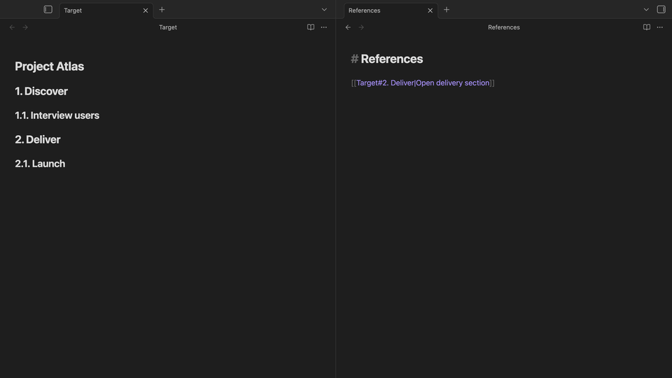

# Heading Keeper

[English](README.md) | 简体中文

自动维护标题编号，也让标题链接始终可用。

<picture>
  <source media="(prefers-reduced-motion: reduce)" srcset="assets/readme/heading-keeper-demo-poster.png">
  
</picture>

**虚拟模式默认启用 · 持久化维护显式开启 · 完全本地离线**

虚拟模式不会修改 Markdown。动画展示的是完成一次显式授权后的持久化模式：
无需手动保存或日常确认，编号和无歧义的标题链接会自动保持同步。

Heading Keeper 是面向 Obsidian 的公开社区插件，完全在本地离线运行。

[安装](#安装) · [下载最新版本](https://github.com/nestealin/obsidian-heading-keeper/releases/latest)

## 为什么选择 Heading Keeper

- 插入、删除或移动标题后，层级编号会静默重排。
- 当标题改名能够被唯一确认时，Wiki 链接和 Markdown 链接会同步更新。
- 历史断链使用独立审计流程，修复前仍需用户明确检查和确认。
- 所有处理都在本地完成，不发送网络请求，也不收集遥测。

## 编号模式

### 虚拟模式

虚拟模式默认启用。它只在编辑视图和阅读视图中渲染编号，不会写入 Vault。

### 持久化模式

持久化模式需要用户显式启用一次。此后，Obsidian 自动保存当前打开的 Markdown
笔记时，Heading Keeper 会自动维护编号。日常维护保持静默，不需要预览、手动保存或再次确认。

插件不会在后台给未打开的笔记编号。笔记真正打开时才会进行整理。启用持久化模式之前，
请停用其他会写入标题编号的插件。

## 标题链接维护

Heading Keeper 基于 Obsidian metadata cache 建立轻量反向索引。当标题改名能够被唯一确认时，
它只更新索引命中的引用笔记。标题改名及其链接更新归属于同一个可持久化、可重试的操作。

历史断链或歧义链接默认保持只读。用户需要运行 **Audit heading links**，选择准确目标、
检查修复计划并确认后，插件才会修改文件。该审计是正常功能中唯一会读取全部 Markdown
正文的操作。

## 安全与隐私

- Heading Keeper 完全在本地离线运行，不发送网络请求、不收集遥测，也不会访问 Vault
  之外的文件。
- 每次写入都会检查文件当前版本，并通过 Obsidian Vault API 执行最小范围编辑。
- 中断的任务会保留并在重试或重启后恢复；已完成编辑的正文会立即丢弃。
- 插件数据不保存笔记全文快照。它最多保留 50 条不含正文的完成摘要，保留七天；未完成任务
  与摘要合计上限为 1 MiB。
- 待恢复任务保存在 `<vault>/.obsidian/plugins/heading-keeper/data.json`，其中只有哈希和
  最小变更片段，没有完整笔记正文。停用插件后删除该文件即可清除本地状态。
- 全库标题链接审计只会在用户显式执行命令后，于内存中读取 Markdown 正文；审计文本
  不会被持久化或传输。
- 过期、冲突或歧义变更会保留原文并等待检查，不会被猜测或覆盖。

## 安装

### 社区插件

在 **设置 → 第三方插件 → 浏览** 中搜索 **Heading Keeper**。如果社区目录仍在审核，
请使用下面的 GitHub Release 安装方式。

### GitHub Release

在社区目录上架前，可以从最新 GitHub Release 下载 `main.js` 和 `manifest.json`，并放入：

```text
<vault>/.obsidian/plugins/heading-keeper/
```

重新加载 Obsidian 并启用 **Heading Keeper**。先保持虚拟模式，检查配置的标题层级和编号格式；
确认后可以在插件设置中显式启用持久化模式。

## 命令

- **Preview current reconciliation**：查看当前笔记计划执行的变更。
- **Reconcile current note now**：立即维护当前活动笔记。
- **Remove managed numbering**：只删除 Heading Keeper 负责管理的编号。
- **Refresh virtual numbering**：刷新渲染的虚拟编号。
- **Audit heading links**：发现已有标题链接问题，并引导用户完成修复。
- **Open Heading Keeper settings**：打开插件设置。

## 兼容性

- 需要 Obsidian `1.12.7` 或更高版本。
- 桌面端已验证虚拟渲染、持久化维护、重启恢复和标题链接同步。
- 插件使用兼容移动端的 Obsidian API，并声明支持移动端；`0.2.1` 的真实移动设备验证仍在进行中。

## 开发

使用 Node `22.20.0` 和 pnpm `11.15.0`：

```bash
corepack pnpm install
corepack pnpm verify:local
corepack pnpm verify:release
```

工作区将 Markdown 解析和编号逻辑放在 `@heading-keeper/core` 中；该模块不依赖 Obsidian、
CodeMirror、DOM 或 Vault API。

## 许可证

Heading Keeper 使用 [MIT License](LICENSE)。
